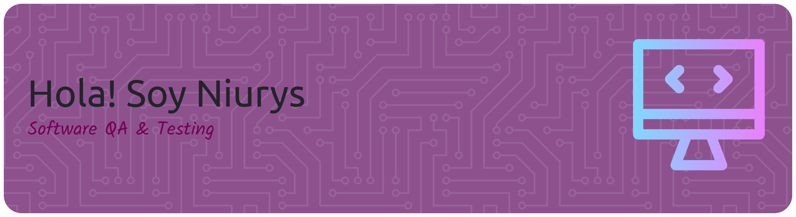

# 💫 About Me:
Hola, soy Niurys, QA Tester con sólida experiencia en testing funcional y en proceso de crecimiento hacia la automatización de pruebas.  Mi enfoque es simple y efectivo: asegurar la calidad del software antes de que los problemas lleguen al usuario final. Trabajo con mentalidad analítica, atención al detalle y una fuerte orientación a procesos, colaborando activamente con equipos de desarrollo bajo metodologías ágiles.  Tengo experiencia ejecutando pruebas manuales sobre aplicaciones web, diseñando y documentando casos de prueba claros y trazables, realizando pruebas de regresión, smoke y exploratorias, y validando APIs REST con Postman. También participo en automatización básica de pruebas UI, fortaleciendo cada sprint con foco en estabilidad y prevención de defectos.  Creo firmemente que la calidad no se prueba al final: se construye desde el primer sprint.

## 🌐 Socials:
 

# 💻 Tech Stack:
          
# 📊 GitHub Stats:
 
 

### 🔝 Top Contributed Repo

---

<!-- Proudly created with GPRM ( https://gprm.itsvg.in ) -->
